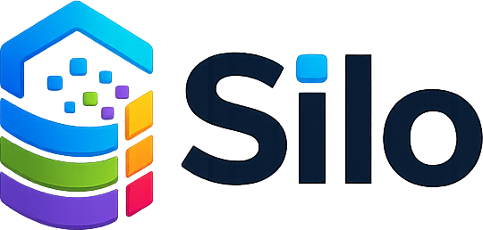
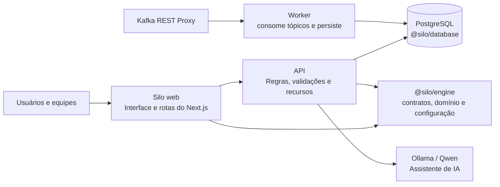
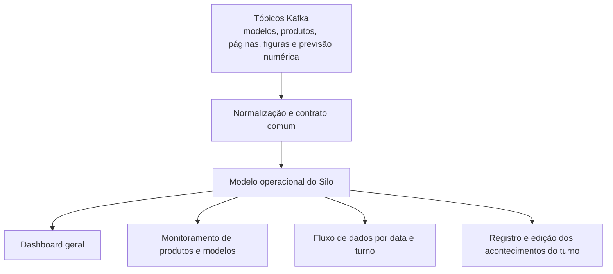

    

# Silo
## Plataforma de organização, rastreabilidade e inteligência operacional para o CPTEC/INPE

### Resumo
O Silo é uma plataforma que reúne, em um único ambiente, os sinais do trabalho técnico e operacional do CPTEC/INPE. Ele conecta produtos, modelos, problemas, soluções, projetos, Kanban, atividades, comunicação, monitoramento e relatórios, para que a leitura do que acontece no dia a dia deixe de depender de memória dispersa.

O valor da plataforma está na conexão entre os elementos. O que antes ficava espalhado entre planilhas, mensagens, documentos e dashboards passa a ser registrado, contextualizado e reaproveitado. Isso reduz perda de informação, melhora a leitura do estado dos produtos e modelos e cria uma base mais sólida para decisão, priorização e acompanhamento.

**Palavras-chave:** gestão do trabalho, produtos meteorológicos, rastreabilidade, monitoramento operacional, conhecimento, Kafka REST Proxy, ecFlow, indicadores.

## 1. O que o Silo é
O Silo é uma plataforma de organização do trabalho técnico e operacional. Ele não substitui a equipe nem o critério técnico; ele dá forma ao que a equipe produz e precisa acompanhar.

No contexto do CPTEC/INPE e da DIPTC, isso significa reunir, em uma mesma leitura, o estado dos produtos, modelos, ocorrências do turno, pendências, projetos e conhecimento acumulado. Em vez de abrir várias ferramentas para entender o cenário, a equipe passa a enxergar o conjunto com mais clareza.

## 2. O problema que o Silo resolve
Há uma diferença importante entre ter informação e conseguir usar a informação com segurança. Ferramentas genéricas costumam resolver apenas uma parte do problema. Um quadro de tarefas mostra andamento; uma wiki guarda texto; um chat acelera conversa; um monitor exibe status; uma planilha organiza números. O que normalmente falta é a conexão entre esses elementos.

O Silo resolve essa lacuna ao aproximar o registro operacional da decisão técnica. O efeito prático aparece em pontos muito objetivos:

| Dificuldade recorrente | Efeito prático | Resposta do Silo |
| --- | --- | --- |
| Informação dispersa entre canais | Retrabalho e perda de histórico | Centralização por produto, modelo e contexto |
| Conhecimento não documentado | Dependência excessiva de pessoas específicas | Base de conhecimento com produtos, problemas e soluções |
| Dificuldade para enxergar o estado dos produtos e modelos | Atraso na identificação de problemas | Monitoramento, fluxo de dados e dashboard geral |
| Tarefas sem vínculo com a operação | Prioridades pouco claras | Kanban ligado a produtos, incidentes e projetos |
| Ocorrências do turno sem registro claro | Visão parcial do que aconteceu | Edição dos acontecimentos do turno no dashboard |
| Projetos sem visão consolidada | Acompanhamento fragmentado | Projetos, Kanban e atividades para a DIPTC |
| Dados operacionais sem rastreabilidade | Baixa confiança em relatórios | Integração com Kafka e contratos normalizados |

Em resumo, o Silo reduz a distância entre o que acontece, o que é registrado e o que a gestão consegue enxergar.

## 3. O que o Silo faz
O sistema foi desenhado como uma plataforma única com módulos complementares. Cada módulo resolve uma parte do ciclo de trabalho, mas todos compartilham o mesmo raciocínio de organização.

- **Dashboard geral:** consolida a visão dos produtos, modelos e turnos; permite registrar e editar acontecimentos do turno para manter a leitura operacional atualizada.
- **Monitoramento operacional:** acompanha produtos, modelos, páginas, figuras e previsão numérica com base nos dados recebidos pelo Kafka.
- **Base de conhecimento:** organiza produtos, problemas e soluções como memória prática da equipe.
- **Projetos, Kanban e atividades:** dão visão geral e acompanhamento dos projetos que acontecem na DIPTC do INPE.
- **Chat interno:** concentra comunicação de grupos e atendimentos com contexto organizacional.
- **Fluxo de dados por produto/data/turno:** mostra a execução detalhada dos dados operacionais.
- **Base de ajuda e documentação:** mantém instruções, manuais e conteúdos de referência próximos da operação.
- **Assistente de IA:** auxilia na consulta de informações internas com rastreabilidade e persistência de contexto.
- **Autenticação e permissões:** controla acesso por domínio, ativação, grupos e regras de autorização.
- **Uploads e relatórios:** dão suporte ao conteúdo técnico que precisa ser armazenado, servido e consultado depois.

O ponto central é que esses módulos não vivem como ilhas. Eles conversam entre si e compartilham o mesmo universo de domínio: produto, modelo, turno, tarefa, incidente, solução, indicador e decisão.

## 4. Funcionamento interno
O Silo é estruturado como um monorepo com fronteiras bem definidas. A interface principal fica em `apps/web`, a API de recursos e autenticação em `apps/api`, e o consumo assíncrono de eventos em `apps/worker`. A lógica compartilhada, os contratos e a configuração central ficam em `packages/engine`, enquanto o banco e o schema vivem em `packages/db`.

Esse desenho importa porque separa claramente responsabilidade de apresentação, regra de negócio e persistência. A interface não conversa diretamente com o banco; o fluxo da plataforma é mediado pela API. O worker processa eventos e consolida efeitos no banco. O pacote de engine concentra regras compartilhadas para evitar duplicação e divergência entre aplicações.

Em termos simples, o sistema opera em quatro camadas:

1. **Apresentação e navegação**: a web entrega a experiência de uso, as páginas administrativas, os formulários e os painéis.
2. **Regra e coordenação**: a API valida dados, expõe recursos e aplica as regras de domínio.
3. **Persistência e histórico**: o PostgreSQL mantém o estado do trabalho, incluindo usuários, produtos, problemas, mensagens, threads e registros operacionais.
4. **Integrações e automação**: o worker, o Kafka REST Proxy, o monitoramento e o assistente de IA completam a leitura do ambiente operacional.

Além disso, o sistema usa autenticação baseada em Better Auth, com sessão via cookie HTTP-only, domínio do CPTEC/INPE validado e permissões agregadas por grupos. Isso evita acesso solto e mantém o uso alinhado ao contexto de uso.

### Diagrama 1. Arquitetura técnica

## 5. Como os dados são obtidos
A origem operacional do Silo é o Kafka REST Proxy. O documento considera apenas o caminho operacional real: os dados entram pelos tópicos Kafka, são normalizados e depois aparecem no dashboard, no monitoramento e no fluxo de dados por turno.

Isso inclui modelos, produtos, páginas, figuras, previsão numérica, eventos do turno e estados de monitoramento. O objetivo é ter um único caminho confiável para os sinais operacionais, sem misturar leitura real com mecanismos de teste.

Os módulos de produtos, problemas e soluções formam a base de conhecimento do Silo. Eles registram o que a equipe aprende no próprio uso da plataforma e mantêm a relação entre ocorrência, causa, resposta e reaproveitamento. Já os acontecimentos do turno e o panorama dos modelos são alimentados pelos dados recebidos via Kafka.

### Diagrama 2. Fluxo operacional via Kafka

## 6. Diferenciais em relação a ferramentas genéricas
Ferramentas tradicionais podem cobrir partes isoladas do problema, mas normalmente não cobrem o ciclo inteiro. O Silo se diferencia por ser construído a partir do domínio real do CPTEC/INPE e da DIPTC, e não por tentar adaptar um produto genérico a uma necessidade específica.

### O que isso muda na prática
- Um gerenciador de tarefas mostra prioridade, mas não conhece produto, modelo, turno e impacto operacional.
- Uma wiki documenta conteúdo, mas não liga isso ao incidente, ao projeto e ao indicador.
- Um chat acelera conversa, mas não preserva o contexto operacional de forma útil.
- Um dashboard exibe status, mas não necessariamente permite revisar o que aconteceu no turno.
- Um sistema genérico de monitoramento pode mostrar sinais, mas não organiza base de conhecimento nem acompanhamento de projetos.

O Silo junta essas dimensões em um mesmo modelo. A plataforma não serve apenas para ver o trabalho, mas para entender o trabalho e acompanhar sua evolução.

Outro diferencial é a capacidade de conectar operação e gestão sem quebrar o fluxo da equipe. O dashboard geral oferece visão rápida; a base de conhecimento preserva aprendizado; o Kanban dá leitura dos projetos da DIPTC; e o monitoramento mostra como os modelos e produtos estão se comportando.

## 7. Tecnologias empregadas
O Silo combina tecnologias modernas, mas o objetivo aqui não é acumular ferramentas; é usar cada uma no lugar onde ela faz sentido.

| Tecnologia | Papel no sistema |
| --- | --- |
| Next.js 16 | Interface principal, rotas, server actions e integração web |
| React 19 | Construção da experiência interativa |
| TypeScript estrito | Consistência de tipos e segurança de manutenção |
| Turborepo + npm workspaces | Orquestração do monorepo |
| Express | API REST de recursos e autenticação |
| PostgreSQL | Persistência dos dados do trabalho |
| Drizzle ORM | Schema, queries e migrações tipadas |
| Better Auth | Autenticação, sessão e fluxos de login |
| Kafka REST Proxy | Consumo e produção de eventos sem broker direto |
| Node.js worker | Processamento assíncrono de eventos |
| Tailwind CSS 4 | Interface visual consistente |
| Apache ECharts | Gráficos e visualizações |
| Sharp | Processamento de imagens e uploads |
| Ollama / Qwen | Camada local do assistente de IA |

O conjunto é coerente com o tipo de problema que o sistema enfrenta: uma aplicação desse tipo precisa ser estável, auditável, evolutiva e previsível, não apenas bonita.

## 8. Relevância para o CPTEC/INPE e para a DIPTC
O valor do Silo para o CPTEC/INPE está no ganho estrutural. Ele reduz a dependência de memória informal e ajuda a manter o conhecimento onde ele pode ser consultado, revisado e reaproveitado. Isso melhora a continuidade do trabalho, inclusive quando há mudança de pessoas, de prioridades ou de contexto operacional.

Para a DIPTC, a plataforma oferece uma visão consolidada do que acontece nos produtos, modelos, turnos e projetos. Isso permite enxergar com mais clareza quais itens estão mais críticos, quais demandas se repetem, quais tarefas travam, onde há perda de informação e quais ações realmente produzem melhoria.

Em termos simples, o Silo ajuda a transformar uma área que trabalha sob pressão operacional em uma área que também aprende com o próprio trabalho. A decisão fica mais objetiva, o acompanhamento mais transparente e o histórico menos dependente de esforço individual.

Para o INPE, isso significa uma forma mais organizada de preservar conhecimento, sustentar entregas e demonstrar valor com evidências. Para a DIPTC, significa reduzir fricção entre operação e gestão, sem perder o detalhe que cada produto e cada modelo exigem.

### Diagrama 3. Ciclo de gestão e aprendizado

## 9. Conclusão
O Silo não é apenas um sistema de apoio. É uma plataforma que organiza o cotidiano técnico e transforma ocorrências, monitoramento e decisões em uma leitura contínua do que acontece no CPTEC/INPE.

Quando uma plataforma registra o trabalho com contexto, ela deixa de servir apenas como interface. Ela passa a funcionar como memória operacional, como mecanismo de rastreabilidade e como base para governança. É esse o papel do Silo no CPTEC/INPE: dar forma ao que normalmente se perde no fluxo do dia a dia e transformar isso em algo utilizável para a equipe e para a gestão.
